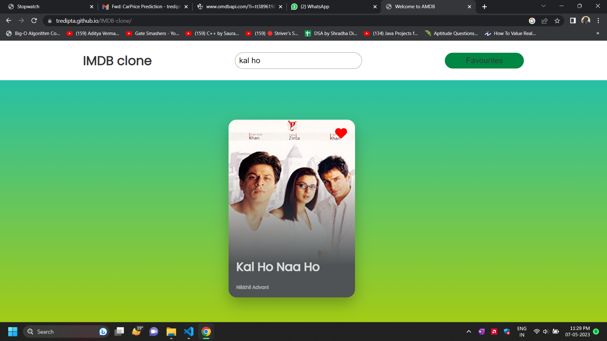

# IMDB-CLONE
IMDB-CLONE By Tredipta Mondal

# IMDB-CLONE using Vanilla JavaScript

<li>This is a repository for IMDB-CLONE Developed using Vanilla JavaScript, HTML, CSS.</li>
 
<li> It is developed to create a soothing Experience with powerful features and clean interface.</li>
 

#About Project
/--------------------------------------------------------/

This project is an IMDB clone app built using vanilla JavaScript and the OMDB API. It has two pages - the Home Page and the Movie Page.

Home Page:
The Home Page has a search bar where users can search for movies using the OMDB API. As the user types, the search results are updated dynamically, just like Google search suggestions. Each search result displays the movie title, year of release, and a "Add to Favorites" button. Clicking on the "Add to Favorites" button adds the movie to the user's favorites list.

Movie Page:
Clicking on a particular search result (movie) opens a new page with more information about that movie. The Movie Page displays the movie poster, title, year of release, plot, and other details (if available) using data fetched from the OMDB API.

The project uses the fetch API to make API requests to the OMDB API and get data about movies. It also uses event listeners to handle user interactions such as searching for movies, adding movies to favorites, and clicking on a search result to view movie details.

The project also makes use of Bootstrap for the styling and layout of the web pages.

I hope this gives you a good understanding of the project and how it works. Let me know if you have any further questions!

# Problem Statement

Create a mini IMDB clone app. Use ONLY vanilla javascript, no libraries or frameworks allowed for Javascript (you can use any css framework like Bootstrap).

 
/-------------------------------------------------------------------------------------------------------------------------------------------------/
# Features Required
/----------------------------------------------------------/
<b>Based on the project requirements you specified earlier, here are the features that are required for the IMDB clone app:</b> 

1. Home Page with a search bar for searching movies. 
2. Dynamically updated search results as the user types. 
3. Each search result displays the movie title, year of release, and a "Add to Favorites" button. 
4. Clicking on the "Add to Favorites" button adds the movie to the user's favorites list. 
5. Clicking on a particular search result (movie) opens a new page with more information about that movie. 
6. The Movie Page displays the movie poster, title, year of release, plot, and other details (if available) using data fetched from the OMDB API. 
7. The app makes use of the OMDB API to fetch data about movies. 
8. The app is built using vanilla JavaScript and does not use any libraries or frameworks for JavaScript. 
9. Bootstrap is used for the styling and layout of the web pages. 
10. The app is responsive and works well on different screen sizes and devices. 
11. The app uses event listeners to handle user interactions such as searching for movies, adding movies to favorites, and clicking on a search result to view movie details. 
12. The app stores the user's favorite movies in a list and allows them to view their favorite movies separately. 
13. The app provides a way to remove movies from the user's favorites list. 
14. The app displays error messages if the user's search query does not return any results or if there is an error fetching data from the OMDB API. 
/---------------------------------------------------------------------------------------------------------------------------------------------------/
# CODE PROCESS
/---------------------------------------------/

1. Setting up the HTML structure for the Home Page and Movie Page.

2. Setting up the Bootstrap CSS framework for styling and layout of the web pages.

3. Writing JavaScript code to fetch data from the OMDB API.

4. Setting up event listeners to handle user interactions such as searching for movies, adding movies to favorites, and clicking on a search result to view movie details.

5. Displaying search results dynamically as the user types using the input event and debounce function to limit the number of API requests sent.

6. Adding the "Add to Favorites" button to each search result and writing JavaScript code to handle adding and removing movies from the favorites list.

7. Creating a new page for displaying movie details and writing JavaScript code to fetch and display data about the movie.

8. Adding error handling for cases where the search query does not return any results or if there is an error fetching data from the OMDB API.

9. Storing the user's favorite movies in the browser's local storage and displaying them on a separate page.

10. Providing a way for users to remove movies from their favorites list.

11. Testing the app to ensure that it works as expected on different screen sizes and devices.

This is a high-level overview of the code process involved in building the IMDB clone app. Of course, there are many more details and specific code implementations that would need to be considered.

/--------------------------------------------------------------------------------------------------------------------------------------/

# PRODUCT DEMO

![IMDB-CLONE]    

# LINKS

<a href = "https://tredipta.github.io/IMDB-clone/"> <b>LIVE PRODUCT</b> </a>  &nbsp; <a href = "https://github.com/tredipta/IMDB-clone"> <b>CODE</b> </a>  

--------------------------------------------------------------------------------------------------------------------------------------------------------
 
<strong>Connect With Me @</strong>

